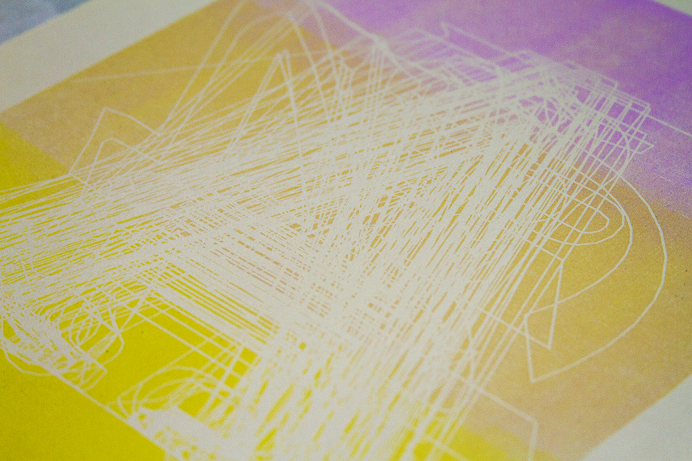

# Printmaking

MFA Design and Technology, Parsons The New School for Design

Printmaking, Professor Martin Mazorra

Fall, 2014

Experimenting with traditional printing techniques and code-generated graphics. So far, using [openFrameworks](http://openframeworks.cc).

---

## Project 1: All Fonts

Made a quick script to load and render all fonts installed in my computer. Used a laser cutter to transfer the result to MDF and then print using a press.

## Project 2: Pomodoro

Since February 2014, I've been tracking how many extra-class hours I work at Parsons. I have the data by class, project, and activity. This first visualization show only the data for Spring 2014, by class.